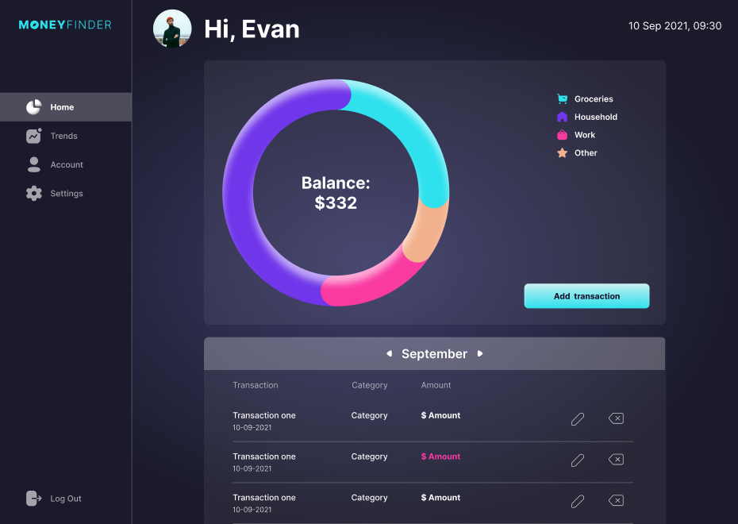
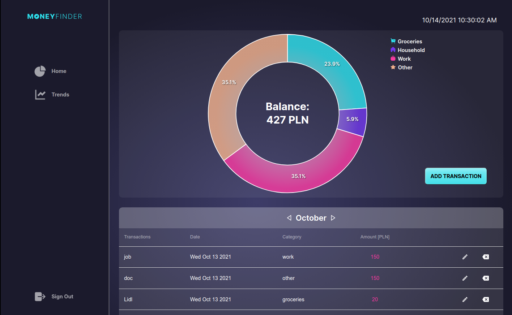
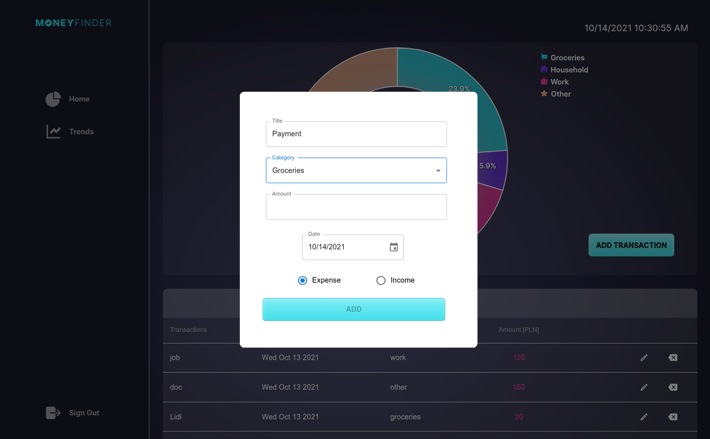
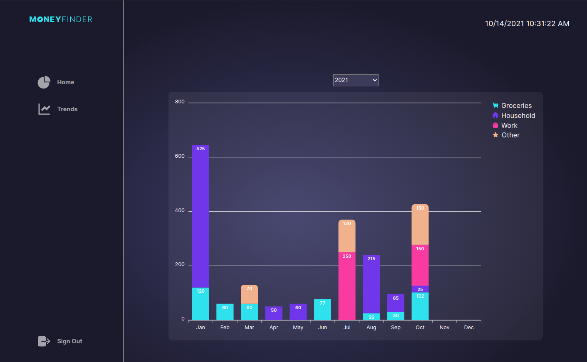

# [MoneyFinder](https://umniedzialateam.web.app/)

### About

MoneyFinder is an app for tracking user's expenses on the monthly and annual basis. Application allows user to quickly and intutively add and edit transactions. All expenses are visualized in the form of helpful charts. The expenses list shows informations in details and allows user to edit or remove transaction quickly. Modern design relates to current UX/UI best practices.

### Functionality

- register and login implemented
- email and password validation
- password recovery
- adding incomes and expenses
- providing details of each transaction (name, category, amount, date and type)
- all transactions displayed in tabular version
- editing and removing transactions
- monthly expanses presented with a donut chart
- annual expenses from last 4 years presented with column chart

### Technologies & tools

- Firebase
- React
- Apex Charts
- Material UI
- Figma
- Styled components

### Views

##### Log in

##### Home

##### Adding transaction

##### Trends chart

### Team

##### [Anna Muszyńska](https://github.com/anna-muszynska) ([LinkedIn](https://www.linkedin.com/in/anna-muszynska/))

##### [Ewelina Purzycka](https://github.com/evi-purzycka) ([LinkedIn](https://www.linkedin.com/in/ewelina-purzycka/))

##### [Katarzyna Bieńkowska-Sulima](https://github.com/kasiabienkowska) ([LinkedIn](https://www.linkedin.com/in/katarzyna-bie%C5%84kowska03/))

##### [Magdalena Ptak](https://github.com/MagPtak) ([LinkedIn](https://www.linkedin.com/in/ptak-magdalena/))
